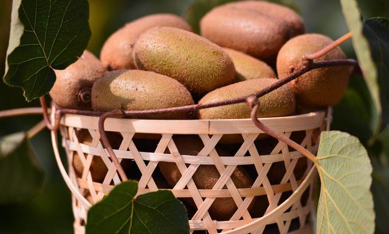
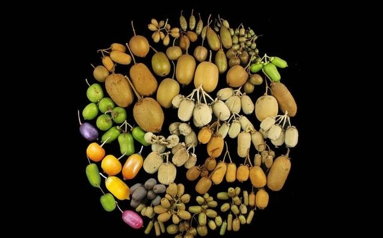

#  我吃过最好吃的猕猴桃！
----

# 特点[详情](detail_character.md)

+ 果香浓郁
+ 汁水四溢
+ 甜酸可口
+ 绿色种植

# 产地[详情](region.md)
+ 秦巴山区
+ 历史名城——汉中
+ 张骞故里——城固
+ 绿色种植

# 联系我们
+ [我要预定]()
+ [给我留言]()
+ [关注我们]()

#  猕猴桃（kiwifruit）小知识
俗称：奇异果
　　学名：猕猴桃
  
  
　　奇异果是猕猴桃的洋名字，奇异果的祖籍在中国，原名叫“猕猴桃”。

   100多年前，一位新西兰女校长在中国旅游时发现了猕猴桃，并将它带回了新西兰，从此开始了猕猴桃的移民生涯。奇异果与猕猴桃是同一种水果，只是由于在新西兰经过培育、改良，才在国际上名声大振。至于为什么叫奇异果，那是因为它酷似新西兰的国鸟——奇异鸟，奇异果除了富含维他命C、A、E以及钾、镁、纤维素外，还含有其他水果中很少见的营养成分——叶酸、胡萝卜素、钙、黄体素、氨基酸、天然肌醇，因而被营养师称之为“营养活力的来源”。据分析，每100克新鲜奇异果肉便含有100至300毫克(甚至超过400毫克)维生素C，比苹果高出20至80倍，比柑桔则高5至10倍。
   
   陕西位于中国内陆腹地，是中华农耕文明的重要发祥地。中国东部的最大山脉、南北方的天然分界线——秦岭是位于陕西境内的主要山脉，蕴藏着丰富的野生动植物资源，不仅拥有大熊猫、金丝猴、朱鹮等稀世珍宝，而且被誉为“人间仙果”的猕猴桃也集中分布在这一地区。由于具有猕猴桃生长优越的自然条件、丰富的品种资源，经过长期的人工驯化、选育、栽培，陕西成为中国猕猴桃最大的产区。
   
   
